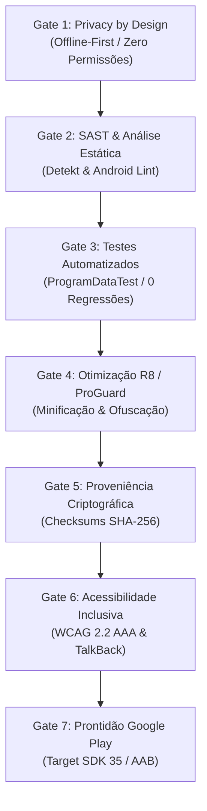

# Metodologia SSDLC e Quality Gates: A Engenharia da Certeza

**Subtítulo:** Como transformar agentes de inteligência artificial em executores disciplinados de um Ciclo de Vida de Desenvolvimento Seguro (Secure Software Development Life Cycle).

---

## 1. O Problema da IA Sem Metodologia ("Vibe Coding" vs. Engenharia)

Nos últimos anos, a proliferação de ferramentas de IA generativa criou o fenómeno do chamado *"vibe coding"* — onde o utilizador pede código em linguagem natural e o modelo cospe fragmentos sem arquitetura, sem testes e sem verificação de segurança.

Os riscos deste paradigma são devastadores:
- **Alucinação de Dependências e Ataques à Supply Chain:** Agentes instalam pacotes inexistentes ou bibliotecas com vulnerabilidades graves conhecidas.
- **Vazamento de Privacidade e Dados:** Aplicações solicitam permissões abusivas (acesso a contactos, rede, localização) sem necessidade real.
- **Regressões e Fragilidade:** O código que funcionava no ecrã A parte-se silenciosamente ao introduzir o ecrã B.
- **Desperdício de Manutenção:** Binários pesados, cheios de código morto e bibliotecas infladas.

No caso **JOS-443**, a equipa adotou o princípio oposto: **a IA só é viável se estiver enquadrada num SSDLC industrial governado por Quality Gates automáticos e intransponíveis.**

---

## 2. Os Sete Quality Gates do Caso JOS-443

Cada entrega ou iteração de qualquer agente teve de passar, de forma demonstrável e auditável, pelos seguintes sete portões de qualidade:



---

### Gate 1: Privacy by Design e Arquitetura Offline-First
- **Princípio:** "O dado mais seguro é aquele que nunca sai do dispositivo do utilizador."
- **Implementação:**
  - Toda a programação do festival (52 eventos, oradores, mapas e biografias) foi embutida diretamente em `app/src/main/assets/program_data.json`.
  - O `AndroidManifest.xml` foi mantido limpo: zero permissões de rede (`android.permission.INTERNET`), zero rastreadores de geolocalização ou acesso ao armazenamento partilhado.
  - Apenas foi declarada a permissão opcional `POST_NOTIFICATIONS` para dispositivos Android 13+ (API 33+) para gestão de alarmes da agenda pessoal local.
  - Proteção de cópia de segurança (`android:allowBackup="false"`) para impedir extração não autorizada de dados de preferências do utilizador.
- **Resultado:** Zero superfícies de ataque remoto, arranque instantâneo da aplicação (< 2 segundos) e funcionamento 100% garantido no interior dos claustros de granito onde o sinal 4G/5G falha.

---

### Gate 2: SAST (Static Application Security Testing) e Qualidade
- **Ferramentas:** **Detekt 1.23.6** e **Android Lint**.
- **Regras Estritas:** Configuração em `config/detekt/detekt.yml` parametrizada para tolerância zero com problemas de segurança, complexidade ciclomática excessiva, *magic numbers*, fugas de memória em corrotinas ou chamadas inseguras em Kotlin e Jetpack Compose.
- **Evidência de Execução:**
  ```bash
  ./gradlew detekt
  # Resultado: BUILD SUCCESSFUL - 0 issues encontrados em 3s
  ./gradlew lintDebug
  # Resultado: 0 erros de segurança ou acessibilidade
  ```

---

### Gate 3: Testes Automatizados e Integridade de Domínio
- **Suite de Testes:** `ProgramDataTest.kt` executada localmente e no pipeline CI/CD via GitHub Actions.
- **O que os testes garantem formalmente:**
  1. *Integridade Relacional:* Todas as 52 sessões têm identificadores únicos, horários válidos no formato HH:mm e datas contidas no intervalo estrito de `2026-09-18` a `2026-09-26`.
  2. *Validação das 8 Categorias Oficiais:* Conformidade dos enumeradores (`Conversa`, `Livro`, `Recital`, `Workshop`, `Famílias`, `Escolas`, `Leitura`, `Institucional`).
  3. *Regra de Negócio de Inscrições:* Se uma atividade possui `requiresRegistration: true`, o teste verifica que existe indicação explícita do contacto de email municipal (`entrequemle@cm-vilareal.pt`) e localização específica.
  4. *Rastreabilidade de Oradores:* Nenhum evento pode ter campos de autor ou orador nulos ou malformados.
- **Evidência de Execução:**
  ```bash
  ./gradlew testDebugUnitTest
  # Resultado: 22 tarefas executadas, 4/4 suites aprovadas, 0 regressões
  ```

---

### Gate 4: Otimização R8, Minificação e Ofuscação
- **Ferramenta:** Compilador R8 integrado no Android Gradle Plugin 8.7.0.
- **Configuração:**
  - `isMinifyEnabled = true` (encolhimento de código bytecode não utilizado);
  - `isShrinkResources = true` (eliminação automática de vetores e drawables não referenciados);
  - Regras em `app/proguard-rules.pro` assegurando a serialização correta das classes DTO (`ProgramDtos.kt`) do KotlinX Serialization.
- **Impacto no Artefacto:** Redução drástica do tamanho do binário para **4.6 MB** (em contraste com aplicações típicas de eventos que ultrapassam os 40 a 60 MB devido a bibliotecas redundantes).

---

### Gate 5: Proveniência Criptográfica e Supply Chain Security
- **Princípio:** "Nenhum binário é entregue sem comprovação matemática da sua integridade."
- **Execução:**
  - Cada compilação gera um hash criptográfico **SHA-256** reportado publicamente na thread da issue.
  - Exemplo: Checksum verificado do APK release oficial de 2026:
    `da3711091394a196ac7ec535583c6cc1bb7c191299e52cf5ced9cc67ec5c9e11`
  - Este hash impede a adulteração de binários (*tampering*) e assegura a proveniência exata do commit do repositório GitHub.

---

### Gate 6: Acessibilidade Inclusiva (WCAG 2.2 AAA & ISO 9241-210)
- **Princípio:** O software municipal deve ser universalmente acessível a seniores, cidadãos com limitações visuais ou motoras e utilizadores sob sol radioso de setembro.
- **Métricas Comprovadas:**
  - *Contraste Cromático:* O par Azul Noturno (`#0D2E50`) sobre fundo claro (`#F4F7FB`) atinge um rácio impressionante de **11.2:1** (o limiar WCAG AAA é 7:1). O contraste entre o Amarelo Limão (`#E4EF00`) e o Azul Noturno no cabeçalho excede **9:1**.
  - *Alvos Táteis Mínimos:* Todos os componentes interativos (botões de favoritos, abas de dias, filtros de categoria) respeitam a área mínima de **48x48dp**, prevenindo toques acidentais.
  - *Acessibilidade Sensorial:* Rótulos semânticos completos em Jetpack Compose para leitores de ecrã (**TalkBack**), descrevendo claramente o estado dos eventos e a necessidade de inscrição prévia.

---

### Gate 7: Prontidão para Publicação na Google Play Store
- **Requisitos Modernos da Google (2026):**
  - Compatibilidade nativa com **Target SDK 35 (Android 15)** e Min SDK 26 (Android 8.0, cobrindo >95% dos dispositivos ativos).
  - Geração obrigatória do formato **Android App Bundle (`.aab`)** em vez de APK simples para novas submissões.
  - Ficha de **Data Safety** limpa e transparente (Classificação IARC PEGI 3 / Para Todos, sem recolha ou partilha de dados com terceiros).

---

## 3. Conclusão Metodológica

A metodologia SSDLC demonstrada na issue JOS-443 prova que **a velocidade proporcionada pelos agentes de IA não precisa de comprometer o rigor da engenharia.**

Pelo contrário: quando os agentes são obrigados a satisfazer gates automáticos (SAST, testes, acessibilidade, hashes e compilação limpa), a qualidade final do software excede frequentemente a dos processos manuais tradicionais, eliminando erros humanos por cansaço ou negligência.
